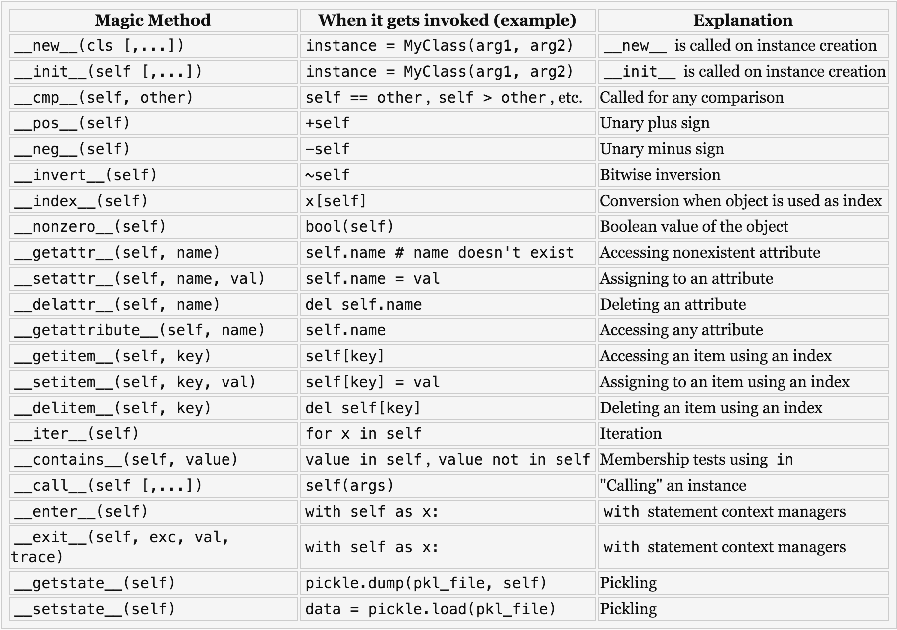

footer: @henocdz
autoscale: true

# Python
## :snake::heart_eyes:

^ Don't get nervous!

---

## Why Python?

### Just trust me, you will love it!

---

## Windows user?

No problem.

Use **Active Python** for Installation


---
# Data Types

```python
# Numbers
a_integer = 2623  # Up to sys.int_info *
a_float = 69.89  # Up to sys.float_info *

#Booleans
of_horse = True
nope = False

# Binary
as_bytes = b'A random text stored as bytes'

# Nothing
my_money = None
```

^ ```
import sys
sys.int_info
```

---

# Data Types
```python
# Sequences
a_string = 'Python is Awesome!'  # Are immutable!
a_string_quotes = "Python is love!"
a_string_triple = '''Python
                        is
                            life!'''

a_list = [1, [2], 1, a_string, 3.67]  # Any size, any data type
a_tuple = (5, ['z'], 89, )  # Same rules of lists apply, but this are immutable
a_tuple_comma = 5, ['z'], 89,  # Comma is the element separator
a_set = set([1, 1, 4, 1])  # =[1,4] Collection with no duplicate elements

```

---

# Data Types

```python
# Dictionaries
a_dict = {  
    # Key can be any immutable object 
    # (i.e, numbers, strings, tuples)
    'some_key': 'some value',
    4: 'another value',
    a_tuple: a_list
    # Can be a key only if the tuple contains immutable objects
}
```

---

# Operators

---

Arithmetic Operators

```python
# Addition (+)
>>> result = 4 + 10
14

# Subtraction (-)
>>> 2014 - 2015
1

# Multiplication (*)
>>> 2 * 10
20
```

---

Arithmetic Operators (cont)

```python
# Division (/)
>>> 10 / 2
5.0  # Type Float

# Floor Division (//)
>>> 10 // 2
5  # Type Integer

# Modulus (%)
>>> 14 % 2

# Exponent (**)
>>> 2 ** 2
4
```

---

Comparison Operators

```python
# Evaluates if two elements are equal
>>> 10 == 10
True

# Evaluates if two elements are not equal
>>> 10 != 5
True

# Evaulates if the value of left operand is greater than the value of right operand
>>> 14 < 2
False

# Viceversa
>>> 14 > 2
True

# >= and <= are also supported
```

---

Assignment Operators

```python

>>> something = 'classic'


# You can combine any arithmetic operator with (=) operator
# like this :)
>>> something *= 3
'classicclassicclassic'
```

---
Membership Operators

```python
>>> 5 in [3, 4, 10]
False

>>> 5 not in [3, 4, 10]
True
```

---
# Control Flow Tools

---

# Conditional Statements

### IF-ELSE
```python
some_bool = True

# if-else structure
>>> if some_bool:
...     print('Some bool it\'s True!!')
>>> else:
...     print('Some bool it\'s not True :(')
```

---
### IF-ELSE-IF
```python
>>> alumni = True
>>> senseis = False

>>> if alumni and senseis:
...     print('We are ready!')
>>> elif alumni:
...     print('Waiting for senseis...')
>>> elif senseis:
...     print('Waiting for alumni...')
>>> else:
...     print('Fuck!')
```

---

### INLINE IF-ELSE
```python
>>> ready = True if alumni and senseis else False
```

---

### FOR

```python
# Iterates over a sequence
# (list, tuple, string, bytes, bytesarray, etc.)
>>> senseis = ('Henoc', 'Gus', 'Sergio', )
>>> for sensei in senseis:
...     print(sensei)

Henoc
Gus
Sergio
```

---

### COMMON FOR

```python
# range(5) > [0, 1, 2, 3, 4]
# range(4, 5) > [4]
>>> for i in range(0, 5):
...     print(i)
0
1
2
3
4
```

---


### WHILE

```python
# Tests the expression and, if it is true, executes the block;
# if the expression is false the loop terminates
>>> im_awesome = True
>>> while im_awesome:
...     stay_awesome()
```

---

### BREAK & CONTINUE

You can control a loop with

1. **break**: terminates the loop
2. **continue**: ignore the rest of the block and returns to evaluate the expression

```python
>>> while True:
...    if im_tired:
...        break
```

---

# Functions

```python
>>> def tellme_the_truth():
...     print('May the force be with You!')

>>> def function_with_params(a_param):
...     print(a_param)

>>> def function_default_values(a_param, has_default=True):
...     """Params with no default value must be defined first"""
...     print(a_param, has_default)

>>> def give_me_the_year():
...     return 2015
```

---

# Lambda Functions

```python
>>> do_something = lambda a_number: a_number * a_number

>>> do_something(14)
196
```

---

### Executing Functions
```python

>>> tellme_the_truth()
May the force be with You!

>>> function_with_params('A string!')
A string!

>>> function_default_values('not a number')
not a number, True

>>> function_default_values('a number', False)
a number, False

>>> function_default_values('default', has_default=False)
default, False

>>> give_me_the_year()
2015
```

---

# I/O
### Communication with real users

---
### Input / Output
```python
>>> user_input = input('Tell me your name: ')
Tell me your name: [[Henoc]]

>>> print(user_input, type(user_input))
Henoc <class 'str'>
```

---

# :scream:

---

# And now what? :unamused:

---

# Running Python Script File

Create a file and edit it with your favorite code editor:


```sh
$ touch file_name.py
$ vim file_name.py

# Run the file
$ python file_name.py
```


---

# Style guides

For example:

Don't use Cammel Case with function or variables, instead you must use snake case i.e,

```python
def thiIsWrong():
```

```python
def this_is_ok():
```

1. PEP8
  a. https://www.python.org/dev/peps/pep-0008/
2. Google Style Guide
  b. http://google.github.io/styleguide/pyguide.html


---
# Exercises

---

# [1] List Overlap

Take two lists, say for example these two:

```python
a = [1, 1, 2, 3, 5, 8, 13, 21, 34, 55, 89]
b = [1, 2, 3, 4, 5, 6, 7, 8, 9, 10, 11, 12, 13] 
```

Then write a program that returns a list that contains only the elements that are common between the lists (without duplicates).
Make sure your program works on two lists of different sizes.

---

# [2] Cows and bulls

Create a program that will play the “cows and bulls” game with the user. The game works like this:

Randomly generate a 4-digit number. Ask the user to guess a 4-digit number. For every digit that the user guessed correctly in the correct place, they have a “cow”. For every digit the user guessed correctly in the wrong place is a “bull.” Every time the user makes a guess, tell them how many “cows” and “bulls” they have. Once the user guesses the correct number, the game is over. Keep track of the number of guesses the user makes throughout teh game and tell the user at the end.
Say the number generated by the computer is 1038. An example interaction could look like this:

```python
Welcome to the Cows and Bulls Game! 
Enter a number: 1234
 2 cows, 0 bulls
 1256
 1 cow, 1 bull
```

Until the user guesses the number.

---

# Hints

You can use **random** module to generate pseudo-random numbers

For example:

```python
>>> import random
>>> random.randint(1000, 9999)
8756
```

---

### Extra Exercises
- [1] Randomly generate two lists to test this

---

# Packages and Modules
# :smiley:

---

# Modules

A file that contains python definitions like functions, classes or variables

So, almost any file it's a module, for example:

```python
# File name: my_math.py
def zum(a, b):
    return a + b

def pow(a, b):
    return a ** b
```

---

We can import a module in other modules like this

```python
# File name: other_file.py
>>> import my_math
>>> print(my_math.zum(3, 4))
7

# Just one definition with
>>> from my_math import zum
>>> print(zum(1, 2))
2

# Single definition with an alias
>>> from my_math import zum as my_sum
>>> print(my_zum(12, 12))
24
```

---

# *Script file vs Module*

If you pass your module name to the interpreter, this is executed as script file, so everything in the module file will be executed _as-is_.

If you don't want that, we can use global variable **___name___** for code that should be executed only in _**script mode**_; like this:

```python
if __name__ = '__main__':
    print('Running as script file...')
```

Global variable **___name___** contains the name of the module, but if the module is executed as an script, this variable contains the string **___main___**

---

# Packages

A folder that contains other packages or module files

```
utils/             
      __init__.py
      my_math.py
      ...
my_script.py
```

`
Use `__init__.py` file to convert a folder into a package

---

And then we can import some module from the __utils__ package like this:

```python
# import definition
>>> from utils.my_math import zum
>>> zum(a, b)
# import module
>>> from utils import my_math
>>> my_math.zum()
```

---

# :rocket:
# Let's rock

---

# Object Oriented Programming 

---

# Classes
### Basic
```python
class Student(object):
    """The Doc string, used for documenting our class"""
    
    # Class attributes
    skills = []

    def __init__(self, belt, skills):  # self points to the current instance
        self.belt = belt
        self.skills = skills

    def get_skills(self):  # self is required
        return self.skills
```

---

## Creating instances

You can create objects or instances like this

```python
# New instance
>>> dany = Student(
...     belt='Red',
...     skills=['Python', 'Javascript']
... )
```

---

## Calling methods

```python
>>> dany.get_skills()
['Python', 'Javascript']
```
---

## Accessing attributes

```python
# Anyone have access to all attributes of a class or object
>>> dany.skills
['Python', 'Javascript']

>>> dany.belt
'Red'

# We can modify class attributes
>>> Student.skills
[]
```

---

## Inheritance

```python
class A(object):
    def some_method(self):
        print('something')

class B(A):
    def some_method(self):
        print('I\'m the class `B :)')
        super(B, self).some_method()

# Basic Inheritance is from left to right
class C(A, B):
    pass
```

_Super-pro algorithm for inheritance: https://www.python.org/download/releases/2.3/mro/_

---

### Magic Methods

Like **`__init__`**

You can use this magic methods to override operators behavior, i.e.,

```python
class Student(object):
    ...
    def __add__(self, other):
        if isinstance(other, self.__class__):
            skills = self.get_skills() + other.get_skills()
            belt = self.belt + other.belt
            return Student(belt, skills)
```

---

Other magic methods:



---

## String formatting

The correct way for concatenation and printing strings combined with other object types

```python
    # Simple way
    "I like to {}".format('code')

    # Simple way 2
    "I {1} to {0}".format('code', 'like')

    # 'Complex' way
    "I {verb} to {what}".format(what='code', verb='like')
```

---

# Exercises

[Exercise 1](https://github.com/comunidad-devf/PythonExercises/tree/master/Classes01)

